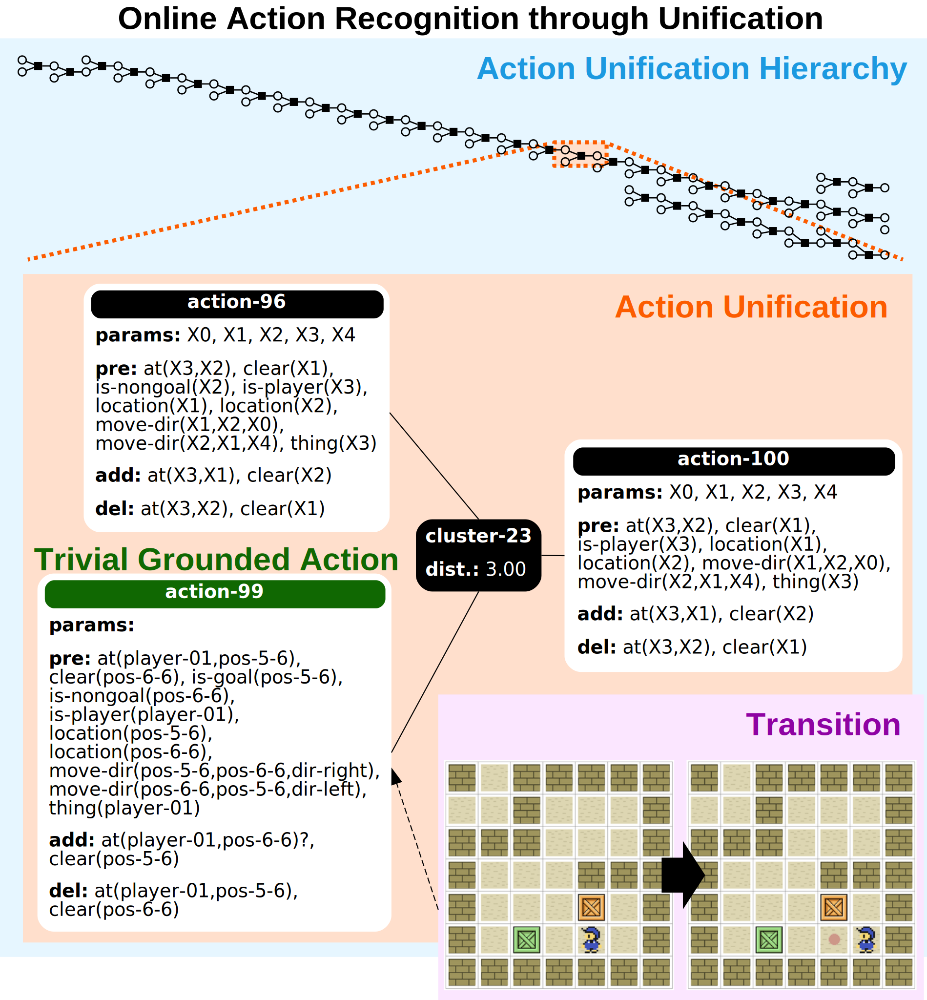

<!-- .slide: class="front-page" -->

# Online Action Recognition

---

<ul class="authors">
  <li>
    

      Alejandro Suárez-Hernández1
      asuarez@iri.upc.edu
    

  </li>

  <li>
    

      Javier Segovia-Aguas1,2
      javier.segovia@upf.edu
    

  </li>

  <li>
    

      Carme Torras1
      torras@iri.upc.edu
    

  </li>

  <li>
    

      Guillem Alenyà1
      galenya@iri.upc.edu
    

  </li>
</ul>

<ol class="affiliations">
  <li>Institut de Robòtica i Informàtica Industrial</li>
  <li>Universitat Pompeu Fabra</li>
</ol>

  
35th AAAI conference on Artificial Intelligence

  
Feb 2-9, 2021

  
  

Notes: Hello, my name is Alejandro Suárez, and I'm with the Institute of Robotics and Industrial
Informatics, in Barcelona. This is a short Introduction to our work, Online Action Recognition.

>>>

## Overview <!-- .element: class="numbered-section" -->

* Interleaved recognition and learning
* Online
* Open world
* No action signatures

Notes: We propose an online method for scalable learning and recognition of STRIPS action models
from a stream of symbolic states in an open world setting, with no action
signatures. To the best of our knowledge, we are the firsts to gather this set
of features in a single method.

>>>

## Contributions <!-- .element: class="numbered-section" -->

* Action Unification (AU)
* Online Action Recognition through Unification (OARU) 

 <!-- .element: width="500px" -->

Notes: We propose Action Unification, an algorithm for merging
actions through an encoding to Weighted Partial MaxSAT. This algorithm supports
partial observability, and it has
generalization properties.

Then, we describe Online Action Recognition through Unification, an algorithm
that builds on top of Action Unification to process a feed of symbolic states,
learn action schemata, and recognize actions between transitions.

<!--This image gives a bird view of our work.-->
<!--In the top, we can see a tree constructed by-->
<!--our OARU algorithm. This tree is the-->
<!--history of actions that have been unified in the past.-->
<!--In the orange area, there's an example of two actions being unified.-->
<!--Action-99 is an ad-hoc explanation overfitted to the transition-->
<!--depicted in the purple area, but it contributes to generalize action-96, which-->
<!--was already in the library. The result is action-100, in the right, a new action-->
<!--with fewer preconditions, but that preserves the effects of its parents, and-->
<!--an instantiation of this action is what OARU uses to explain the transition.-->

>>>

<!-- .slide: data-visibility="hidden" -->

## Result overview <!-- .element: class="numbered-section" -->

* We achieve real-time performance <!-- .element: class="fragment fade-in-then-semi-out" -->
* Partial observability demands higher computational resources <!-- .element: class="fragment fade-in-then-semi-out" -->
* Recognition quality metrics are close to 100% in many problems in full observability. <!-- .element: class="fragment fade-in-then-semi-out" -->
  * However their variance is larger in partial observability.
* The action library stabilizes quickly in most domains. <!-- .element: class="fragment fade-in-then-semi-out" -->

>>>

Thank you <!-- .element: class="r-fit-text" -->

Note: Thank you very much for your attention. If you're intrigued, please
see the full presentation video, and don't hesitate to join the poster session
to ask doubts.

