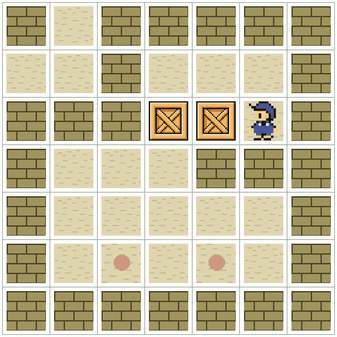

<!-- .slide: class="front-page" -->

# Online Action Recognition

---

<ul class="authors">
  <li>
    

      Alejandro Suárez-Hernández1
      asuarez@iri.upc.edu
    

  </li>

  <li>
    

      Javier Segovia-Aguas1,2
      javier.segovia@upf.edu
    

  </li>

  <li>
    

      Carme Torras1
      torras@iri.upc.edu
    

  </li>

  <li>
    

      Guillem Alenyà1
      galenya@iri.upc.edu
    

  </li>
</ul>

<ol class="affiliations">
  <li>Institut de Robòtica i Informàtica Industrial</li>
  <li>Universitat Pompeu Fabra</li>
</ol>

  
35th AAAI conference on Artificial Intelligence

  
Feb 2-9, 2021

  
  

Notes: Hello, my name is Alejandro Suárez, and I'm with the Institute of Robotics and Industrial
Informatics, in Barcelona. I'd like to present our work, Online Action Recognition.

>>>

## Overview <!-- .element: class="numbered-section" -->

* Scalable learning and recognition of STRIPS actions <!-- .element: class="fragment fade-in-then-semi-out" -->
* Open world states<!-- .element: class="fragment fade-in-then-semi-out" -->
* No a priori information <!-- .element: class="fragment fade-in-then-semi-out" -->

Notes: In our paper, we propose (tap)
a method for scalable learning and recognition of STRIPS action models (tac)
from symbolic states in an open world, (tap)
with no prior information about the actions.

vvv

### Motivation

* Batch techniques not suited for real time or need action signatures <!-- .element: class="fragment fade-in-then-semi-out" -->
  * ARMS (Wu et al, 2005+) (Not online)
  * FAMA (Aineto et al, 2019) (Not online)
  * SLAF (Amir, Chang, 2008) (Online, but needs action signatures)
* Alternative: online model acquisition  <!-- .element: class="fragment fade-in-then-semi-out" -->
* Added challenge: partial observability <!-- .element: class="fragment fade-in-then-semi-out" -->
* Explainability                         <!-- .element: class="fragment fade-in-then-semi-out" -->

Notes: Let's go over some of the facts that motivate our work (tap). First, hand-crafted action models are hard to acquire,
so numerous learning approaches have been proposed. However, many of these
are not really meant for an online use case, or need a database of action signatures (tap).
Enabling artificial agents to learn from an online
feed of symbolic states becomes, thus, a relatively unexplored alternative (tap).
Many real-world applications, however, exhibit the added challenge of partial observability,
so we'd like to retain the ability of SLAF to deal with that. Last, but not least, we should
care and press on action recognition because it's a step forward to improve the
explainability of AI agents.

vvv

### Contributions

* Action Unification (AU)                              <!-- .element: class="fragment fade-in-then-semi-out" -->
* Online Action Recognition through Unification (OARU) <!-- .element: class="fragment fade-in-then-semi-out" -->

Notes: So, what are our contributions? First (tap), we propose
the Action Unification for finding the commonalities between
two actions and generalizing them. Second (tap), we
describe Online Action Recognition through Unification, or OARU, a greedy algorithm
that uses AU as a building block to recognize actions in a stream of consecutive
states, and that doesn't require the number or structure of the actions.

vvv

<!-- .slide: data-visibility="hidden" -->

 <!-- .element: height="600px" -->

Notes: This image gives a bird view of our work.
In the top, we can see a tree constructed by
our OARU algorithm. This tree is the
history of actions that have been unified in the past.
In the orange area, there's an example of two actions being unified.
Action-96 was there before, but action-99 is an ad-hoc action that is
only able to justify the transition shown in the bottom.
The result of merging the two is action-100, an action with fewer preconditions
but that preserves the effects of its parents.

>>>

## Background <!-- .element: class="numbered-section" -->

* For every open world state      <!-- .element: class="fragment fade-in-then-semi-out" -->
`$ s $` and each ground predicate `$ f = p_n(c_1,\dots,c_n) $`: `$$ \mathcal{I}_s( f ) \in \{ \mathrm{true}, \mathrm{false}, \mathrm{unknown} \} $$`
* STRIPS actions are of the form: <!-- .element: class="fragment fade-in-then-semi-out" -->
`$$ \alpha = \langle \mathit{head}_\alpha, \mathit{pre}_\alpha, \mathit{add}_\alpha, \mathit{del}_\alpha \rangle $$`

Notes: Allow me to introduce the language that I'll be using in
this presentation. First (tap), each state is an interpretation over the set of
all possible grounded predicates.
Since we're in an
open world setting, we allow predicates with unknown interpretation (tap).
We'll also be working with STRIPS
actions. STRIPS actions have a head, which is the combination of its name and its
parameters. It also has a precondition, which is
is the conjunction of predicates that must evaluate to true in a state in order
for the action to be applicable in a certain state, an add list that gathers the predicates that
become true after its application, and a delete list which contains the predicates
that become false.

vvv

### Fully observable state

<figure>
  

  

  
1

  
2

  
3

  
4

  
5

  
6

  
7

  
1

  
2

  
3

  
4

  
5

  
6

  
7

  

  
4-2

  
5-2

  

  
4-4

  

  
3-3

  

  <figcaption>State in Sokoban puzzle<small>This image and similar in the next slides have been produced by PDDLGym (Silver et al, 2020)</small></figcaption>
</figure>

<pre style="margin-left: 50px;">
move-dir(pos-4-2,pos-5-2,dir-right)
move-dir(pos-5-2,pos-4-2,dir-left) 
clear(pos-4-2), clear(pos-5-2) 
...
is-player(player-01)
at(player-01,pos-4-4)
...
is-goal(pos-3-6)
...
</pre>

Notes: Let's get familiar with these concepts and with the running example I'll be using
along the presentation: Sokoban. In fully observable settings, a state can be
described just as a set of the predicates that are active. In this case (tap),
we have a few predicates to describe the adjacency between cells and wether
they are empty (tap), predicates to identify the player and its position (tap),
predicates to designate the goal of the crates, and more.

vvv

### Partially observable state

<figure>
  

  

  
1

  
2

  
3

  
4

  
5

  
6

  
7

  
1

  
2

  
3

  
4

  
5

  
6

  
7

  

  
?

  
?

  
?

  
?

  
?

  
?

  

  <figcaption>Unknown location of the player</figcaption>
</figure>

<pre style="margin-left: 50px;">
at(player-01,pos-4-3)?
at(player-01,pos-5-3)?
at(player-01,pos-3-4)?
at(player-01,pos-4-4)?
at(player-01,pos-4-5)?
at(player-01,pos-5-5)?
...
</pre>

Notes: So, how would we do this in an open world setting? Our take is to mark predicates
with a flag that indicates whether they are active or uncertain (tap).
Imagine, for instance, the Sokoban grid with some sort of fog hovering over
the center of the board, such that we're not longer sure of the position of the
player. In this example, we mark the uncertain predicates with a question mark.

vvv

### STRIPS actions

<figure class="fragment" data-fragment-index="0">

  

  

  
1

  
2

  
3

  
4

  
5

  
6

  
7

  
1

  
2

  
3

  
4

  
5

  
6

  
7

  

  

  

  

  
1

  
2

  
3

  
4

  
5

  
6

  
7

  
1

  
2

  
3

  
4

  
5

  
6

  
7

  

<figcaption style="font-size:36px">Example: move(player-0,pos-4-4,pos-3-4,left)

`$ \sigma = \{ P \rightarrow \text{player-0}, From \rightarrow \text{pos-4-4}, To \rightarrow \text{pos-3-4}, Dir \rightarrow \text{left} \} $`
</figcaption>
</figure>

Notes: This is the format we'll be using for a STRIPS action. This example is
the action for moving around without pushing crates (tap). Actions can be
grounded, like this, to indicate a specific displacement of the player
to the left. We designate instantiations, and substitutions in general, with 
the sigma notation you can see at the bottom.

>>>

## The problem <!-- .element: class="numbered-section" -->

* Recognize action for each state transition    <!-- .element: class="fragment fade-in-then-semi-out" -->
* Maintain a library of action schemata         <!-- .element: class="fragment fade-in-then-semi-out" -->
* No action signatures, only predicates and objects in states <!-- .element: class="fragment fade-in-then-semi-out" -->

Notes: With background concepts fresh, let us delve into the details of our
problem (tap).
As I foreshadowed earlier, we seek to find the ground action responsible for a
transition from one state to the next. Of course (tap), to do this we need to maintain a library
of parameterized actions (tap), so that the recognized actions are not
overfitted to the transition. This library
is not given beforehand, so we have to infer it from the predicates and objects that appear
in the states.

vvv

### Input

<figure>

<figcaption>
Solution of a Sokoban puzzle
</figcaption>
</figure>

<ul>
 <li class="fragment fade-in-then-semi-out">Observation stream: $ \mathcal{O} = \{ o_1, o_2, \dots \} $, with $ o_i = (s_i,s_{i+1}) $.
 <li class="fragment fade-in-then-semi-out">Action library (possibly empty) $ \mathcal{A} = \{ \alpha_1, \alpha_2, \dots \} $</li>
</ul>

Notes: let's be a bit more formal about the input (tap). We assume there's a procedure
that streams symbolic states and groups them into observations, like this. Each
observation is just tuple formed by a state and its successor. Then (tap), another
part of the input is the action library, which for the very first observation,
will be empty, but as observations arrive, it will be extended and refined.

vvv

### Output

* For each <!-- .element: class="fragment fade-in-then-semi-out" -->
`$ o = (s,s') $`, provide `$ a_g $` s.t. `$ s \xrightarrow{a_g} s' $`
  * `$ a_g $`: ground action that explains $ s \rightarrow s' $
  * Can be thought as "completing the observation": `$ (s,s') \rightarrow (s,a_g,s') $`
* Updated action library $ \mathcal{A}' $  <!-- .element: class="fragment fade-in-then-semi-out" -->
with new or modified schemata.
* <!-- .element: class="fragment fade-in-then-semi-out" --> $ a_g = \sigma \alpha $ for some $ \sigma $ and $ \alpha \in \mathcal{A}' $.

Notes: (Tap) the goal for each observation is
to provide a grounded action that explains the transition from one state to
the next. As we'll see later, providing an overfitted grounded action is actually very easy,
so the second part of the output (tap) is far more challenging. It consists in
an updated, more general, action library. The long-term goal is a concise set
of action schemata
that can be instantiated to explain all the previous observations (tap).
Notice that this is deeply intertwined with the
recognition of the ground action, since we'd like that the recognized action
is an instantiation of some action in the library.

vvv

### Example

<!-- .slide: data-visibility="hidden" -->

<dl>
<dt>Input</dt>
<dd>
<ul>
<li class="fragment fade-in-then-semi-out" data-fragment-index="0">$ o = (s,s') $</li>
<li class="fragment fade-in-then-semi-out" data-fragment-index="1">Expert given $\mathcal{A}$</li>
</ul>
</dd>
<dt>Output</dt>
<dd>
<ul>
<li class="fragment fade-in-then-semi-out">$ a_g = $ move(player-0, pos-4-4, pos-3-4, left)</li>
<li class="fragment fade-in-then-semi-out">$ \mathcal{A} $ unchanged</li>
</ul>
</dd>
</dl>

  
  

  

vvv

<!-- .slide: data-visibility="hidden" -->

### Empty action library?

<dl>
<dt>Input</dt>
<dd>
<ul>
<li class="fragment fade-in-then-semi-out" data-fragment-index="0">$ o = (s,s') $</li>
<li class="fragment fade-in-then-semi-out" data-fragment-index="1">$\mathcal{A} = \emptyset$</li>
</ul>
</dd>
<dt>Output</dt>
<dd>
<ul>
<li class="fragment fade-in-then-semi-out" data-fragment-index="2"> $ a_g = \text{action-1} $</li>
<li class="fragment fade-in-then-semi-out" data-fragment-index="3">$ \mathcal{A} = \{ \text{action-1} \} $</li>
</ul>
</dd>
</dl>

  
  

  

vvv

<!-- .slide: data-visibility="hidden" -->

### A crucial observation

The recognition of the action for an observation <!-- .element: class="highlight" -->
`$ o \in \mathcal{O} $` is not independent from previous subproblems!

Notes: All this leads us to a crucial observation.
Since the action library depends on the previous observations, and the
recognition of an action depends on the action library, the recognition subproblems
are not independent.

>>>

## Methodology <!-- .element: class="numbered-section" -->

Start with $ \mathcal{A} = \emptyset $. For each $ o = (s,s') \in \mathcal{O} $:
1. <!-- .element: class="fragment fade-in-then-semi-out" --> Create a Trivial Grounded Action (TGA) $ a $
2. Try to merge <!-- .element: class="fragment fade-in-then-semi-out" --> $ a $ with the closest action $ \alpha \in \mathcal{A} $, otherwise...
3. ... add <!-- .element: class="fragment fade-in-then-semi-out" --> $ a $ directly to $ \mathcal{A} $
4. Return <!-- .element: class="fragment fade-in-then-semi-out" --> $ a_g = \sigma \alpha' $ s.t. $ \alpha' \in \mathcal{A} $ and $ s \xrightarrow{a_g} s' $.

Notes: We want to start from an empty action library but we'd like to fill it with
general parameterized actions! How do we do it? For each observation (tap), we create
an ad-hoc action, what we call Trivial Grounded Action or TGA. Then (tap), we try to
unify this TGA with the closest action in the current library. If unification is
not possible (tap), then the TGA is directly added to the action library. In
any case (tap), the returned action is an instantiation of one of the actions
in the modified library.

vvv

### Creation of TGAs (full observability)

  <!-- [1] -->

  <!-- [2] -->

From `$ s $` and `$ s' $` create parameter-less action `$ a $`:

* $ \mathit{head}_a = a() $
* <!-- .element: class="fragment highlight-current-blue" data-fragment-index="3"--> $ \mathit{pre}_a = s $
* <!-- .element: class="fragment highlight-current-green" data-fragment-index="4" --> $ \mathit{add}_a = s' \setminus s $
* <!-- .element: class="fragment highlight-current-red" data-fragment-index="5" --> $ \mathit{del}_a = s \setminus s' $

                  <!-- [2] -->

  <!-- [5] -->

  <!-- [6] -->

  <!-- [3] -->

a

b

<pre class="fragment highlight-current-blue" data-fragment-index="3">
is-player(player-01)
location(a)
location(b)
at(player-01,a)
clear(b)
move-dir(a,b,right)
move-dir(b,a,left)
</pre>

                  <!-- [3] -->

  <!-- [4] -->

<pre>
is-player(player-01)
location(a)
location(b)
at(player-01,b)
clear(a)
move-dir(a,b,right)
move-dir(b,a,left)
</pre>

                  <!-- [4] -->

                  <!-- [6] -->

       <!-- [7] -->

$ a() $

<strong>Pre:</strong> All predicates in $ s $

<strong>Add:</strong> at(player-01,b), clear(a)

<strong>Del:</strong> at(player-01,a), clear(b)

                  <!-- [7] -->

                  <!-- [5] -->

                  <!-- [1] -->

Notes: the construction of TGAs in full observability is easy to formalize.
Here we have a transition in a very
simplified sokoban map, from right to left. Let's call the cells (tap) a, and (tap) b.
To construct a TGA (tap), we set the first state directly as the precondition.
Then (tap), we can construct the add list directly as a set difference, retaining
the predicates that are active in the second state but not in the first. And (tap),
for the delete list, we just reverse the order of the operands, as if imagining
the transition backwards.

vvv

### With partial observability

  <!-- [1] -->

  <!-- [2] -->

Preconditions and effects are flagged:

* <!-- .element: class="fragment" data-fragment-index="1"--> $ \iota(p) = \text{true} $ iff predicate $ p $ is certain...
* <!-- .element: class="fragment" data-fragment-index="2" --> ... and $ \iota(p) = \text{false} $ otherwise (?).

                                      <!-- [2] -->

  <!-- [5] -->

  <!-- [6] -->

  <!-- [3] -->

?

?

<pre class="fragment highlight-current-blue" data-fragment-index="3">
is-player(player-01)
location(a)
location(b)
at(player-01,a)?
at(player-01,b)?
clear(a)?
clear(b)?
move-dir(a,b,right)
move-dir(b,a,left)
</pre>

                  <!-- [3] -->

  <!-- [4] -->

<pre>
is-player(player-01)
location(a)
location(b)
at(player-01,b)
clear(a)
move-dir(a,b,right)
move-dir(b,a,left)
</pre>

                  <!-- [4] -->

                  <!-- [6] -->

       <!-- [7] -->

$ a() $

<strong>Pre:</strong> All predicates in $ s $

<strong>Add:</strong> at(player-01,b)?, clear(a)?

<strong>Del:</strong> at(player-01,a)?, clear(b)?

                  <!-- [7] -->

                  <!-- [5] -->

Notes: With partial observability and uncertain predicates the construction is 
a bit different. Some predicates we may know for sure that evaluate
to true (tap), and some others that are uncertain (tap).
In this example, in the first state the location of the player
is unknown. Like before (tap), this state is directly the precondition, with the only
difference that the uncertain predicates, differentiated with a question mark,
are not hard requirements (tap). Now, for the add list we have to consider
all the predicates that potentially became true during the transition, and if
they're uncertain in any of the states, then they are flagged as such in the TGA (tap).
And this reasoning is applied backward to construct the delete list.

vvv

### Action Unification (AU)

* <!-- .element: class="fragment fade-in-semi-out" --> Given $ \alpha_1, \alpha_2 $, find $ \alpha_u $ that generalizes both actions.
* <!-- .element: class="fragment fade-in-semi-out" --> $ \exists \sigma_1, \sigma_2 $ s.t. $ \mathit{eff}_{\sigma_i \alpha_u, \iota(\cdot) = \text{true}} = \mathit{eff}_{\alpha_i, \iota(\cdot) = \text{true}} $ and
  `$ \mathit{pre}_{\sigma_i \alpha_u} \subseteq \mathit{pre}_{\alpha_i} $` for `$ i \in \{1,2\} $`
* <!-- .element: class="fragment fade-in-semi-out" --> Relax as few preconditions and uncertain predicates
* <!-- .element: class="fragment fade-in-semi-out" --> Introduce as few parameters as possible.

AU is <!-- .element: class="fragment" -->  **NP-Hard**!

Notes: Now, for what is probably the central part of this paper: Action Unification (tap).
As I said earlier, this is the mechanism used to merge two actions a1 a2 into a more general
action au (tap). Namely, the problem of Action Unification is to find an action
$ a_u $ that can be instantiated or partially instantiated into $ a_1 $ and $ a_2 $, via
two substitutions $ \sigma_1 $ and $ \sigma_2 $, in a way that all the certain effects
are preserved, and the precondition is a relaxation of the original two preconditions.
Action Unification is, in many ways, like finding the common factor between two actions.
In addition (tap),
we seek to minimize the number of relaxed preconditions and uncertain predicates (tap),
and to introduce as few parameters as possible (tap).

It's worth noting that the problem that AU addresses is NP-Hard. Fortunately,
it can be solved efficiently in many practical situations.

vvv

### How do we solve AU?

* Weighted Partial Max-SAT encoding (WPMS) <!-- .element: class="fragment fade-in-then-semi-out" --> 
  * `$ \Phi = \{ (c_1, w_1), \dots, (c_n, w_n) \} $`, with $ w_i \geq 0 $
  * If $ w_i = \infty $, $ c_i $ is a **hard clause**.
  * If $ w_i \lt \infty $, $ c_i $ is a **soft clause**.
* Z3 solver (De Moura, Bjørner) <!-- .element: class="fragment" -->

Notes: To do Action Unification, we encode the problem of finding $ a_u $ as 
a Weighted Partial Max-SAT problem, or WPMS (tap). WPMS is an optimizing variant of
SAT, in which the clauses have positive weights, up to infinity.
Clauses with infinite weight are hard clauses (tap). To solve the resuling problem
we use the Z3 model because it is very mature software and has a nice API,
although we do not use SMT features.

vvv

### Overview of the encoding to WPMS

* <!-- .element: class="fragment fade-in-then-semi-out" --> Map $ \tau : O \rightarrow O $ from objects in $ a_1 $ to objects in $ a_2 $.
* <!-- .element: class="fragment fade-in-then-semi-out" --> Predicates $ p_n(c_1,\dots,c_n) \in a_1 $ and $ p_2(c_1',\dots,c_n') \in a_2 $ match iff
  $ \tau(c_i) = c_i'~\forall i $
* <!-- .element: class="fragment fade-in-then-semi-out" --> A predicate in $ a_i $ is preserved iff it has a match
* <!-- .element: class="fragment fade-in-then-semi-out" --> All $ \iota(\cdot) = \text{true} $ effects are preserved (hard)
* <!-- .element: class="fragment fade-in-then-semi-out" --> Preserve all preconditions and uncertain predicates (soft)
* <!-- .element: class="fragment fade-in-then-semi-out" --> Avoid lifting objects (soft)

Notes: The details of the encoding are a little bit dry, so I'll just outline the general
idea. If you're interested, the encoding is explained in full detail in the paper (tap).

We define a injective partial map tau from the objects in a1 to the objects in a2 (tap).

A predicate in a1 can match another predicate in a2 if tau maps the arguments of a1 to the arguments of a2 (tap).

A predicate is preserved if it matches a predicate from the other action (tap).

And finally, we have some hard and soft constraints to guarantee that effects are preserved (tap),
as few as possible preconditions and uncertain predicates are relaxed (tap), and as few parameters
as possible are introduced.

vvv

### Example of AU

a

b

c

$ a_1 $

<strong>Pre:</strong> at(p,a), clear(b), clear(c), move-dir(a,b,right), move-dir(b,a,left),move-dir(b,c,right), move-dir(c,b,left) 

<strong>Add:</strong> at(p,b), clear(a) 

<strong>Del:</strong> at(p,a), clear(b) 

$ a_2 $

<strong>Pre:</strong> at(p,b), clear(a), clear(c), move-dir(a,b,right), move-dir(b,a,left), move-dir(b,c,right), move-dir(c,b,left) 

<strong>Add:</strong> at(p,c), clear(b) 

<strong>Del:</strong> at(p,b), clear(c) 

$ a_u(X_1,X_2) $

<strong>Pre:</strong> at(p,$ X_1 $), clear($ X_2 $), move-dir($ X_1 $,$ X_2 $,right), move-dir($ X_2 $,$ X_1 $,left) 

<strong>Add:</strong> at(p,$ X_2 $), clear($ X_1 $) 

<strong>Del:</strong> at(p,$ X_1 $), clear($ X_2 $) 

$$ \mathit{dist}_{a_u,a_3} = 4.14 $$

$ \tau $

<ul>
<li class="fragment highlight-current-blue" data-fragment-index="2">a $ \rightarrow $ b ($ X_1 $)</li>
<li class="fragment highlight-current-blue" data-fragment-index="3">b $ \rightarrow $ c ($ X_2 $)</li>
<li class="fragment highlight-current-blue" data-fragment-index="4">p $ \rightarrow $ p</li>
<li class="fragment highlight-current-green" data-fragment-index="4">right $ \rightarrow $ right</li>
<li class="fragment highlight-current-red" data-fragment-index="4">left $ \rightarrow $ left</li>
</ul>

Notes: Hopefully, all these ideas should become much clearer after a few examples.
Again, we have a small sokoban world. Cells are named abc, and we seek to unify
actions a1 and a2, which are directly derived from the transitions at the top of
the slide. This (tap), is the result. At the bottom right, you can see the
tau mapping from objects in a1 to objects in a2. If the objects are constants with
different names, they are lifted because AU assumes that they are variable. For
instance (tap), a is mapped to b, because in both actions they play the role of
the origin cell. Something similar happens to b (tap), which is mapped to c, because
they're the destination cell. The rest of the objects (tap) map to themselves.
It turns out that, from the WPMS objective function we can derive a distance
between the two actions (tap), which in this case happens to be 4.14. Intuitively:
the integer part, 4, is the number of predicates that couldn't be preserved (tap),
two move-dir predicates in a1 and two in a2. The fractional part is proportional
to the number of introduced parameters. Preserving predicates has priority over
introducing parameters, so the cost function is constructed in a way that ensures
that this is always true. If we step back and look at the result, we can see that
AU has generalized the actions into the concept of moving right, and the final
and initial positions are no longer hard-coded.

vvv

<!-- .slide: data-visibility="hidden" -->

$ a_u(X_1,X_2) $

<strong>Pre:</strong> at(p,$ X_1 $), clear($ X_2 $), move-dir($ X_1 $,$ X_2 $,right), move-dir($ X_2 $,$ X_1 $,left) 

<strong>Add:</strong> at(p,$ X_2 $), clear($ X_1 $) 

<strong>Del:</strong> at(p,$ X_1 $), clear($ X_2 $) 

$ a_3 $

<strong>Pre:</strong> at(p,c), clear(a), clear(b), move-dir(a,b,right), move-dir(b,a,left), move-dir(b,c,right), move-dir(c,b,left) 

<strong>Add:</strong> at(p,b), clear(c) 

<strong>Del:</strong> at(p,c), clear(b) 

$ a_v(X_1,X_2,X_3,X_4) $

<strong>Pre:</strong> at(p,$ X_1 $), clear($ X_2 $), move-dir($ X_1 $,$ X_2 $,$ X_3 $), move-dir($ X_2 $,$ X_1 $,$ X_4 $) 

<strong>Add:</strong> at(p,$ X_2 $), clear($ X_1 $) 

<strong>Del:</strong> at(p,$ X_1 $), clear($ X_2 $) 

$$ \mathit{dist}_{a_u,a_3} = 2.33 $$

$ \tau $

<ul>
<li>$ X_1 \rightarrow $ c ($ X_1 $)</li>
<li>$ X_2 \rightarrow $ b ($ X_2 $)</li>
<li>p $ \rightarrow $ p</li>
<li class="fragment highlight-current-green" data-fragment-index="3">right $ \rightarrow $ left ($ X_3 $)</li>
<li class="fragment highlight-current-red" data-fragment-index="3">left $ \rightarrow $ right ($ X_4 $)</li>
</ul>

Notes: Now, we can repeat this process between the previous unified action and a
new TGA in which the agent is moving left. This (tap) is the result. Now, this
is interesting because AU discovers that the directions are also mutable, so it
substitutes them by variables x3 and x4. The distance now is (tap) 2.33, and only
two move-dir predicates in action a2 are not preserved (tap).

vvv

### With partial observability

<!-- .slide: data-visibility="hidden" -->

$ a_1 $

<strong>Pre:</strong>at(p,a), clear(b), move-dir(a,b,right), move-dir(b,a,left)

<strong>Add:</strong>at(p,b), clear(a) 

<strong>Del:</strong>at(p,a), clear(b) 

?

?

$ a_2 $

<strong>Pre:</strong> at(p,b), clear(b), move-dir(a,b,right), move-dir(b,a,left)

<strong>Add:</strong> at(p,a)?, clear(a)? 

<strong>Del:</strong> at(p,b)?, clear(b)? 

$ a_u(X_1,X_2,X_3,X_4) $

<strong>Pre:</strong> at(p,$ X_1 $), clear($ X_2 $), move-dir($ X_1 $,$ X_2 $,$ X_3 $), move-dir($ X_2 $,$ X_1 $,$ X_4 $) 

<strong>Add:</strong> at(p,$ X_2 $), clear($ X_1 $) 

<strong>Del:</strong> at(p,$ X_1 $), clear($ X_2 $) 

$$ \mathit{dist}_{a_u,a_3} = 0.67 $$

$ \tau $

<ul>
<li>a $ \rightarrow $ b ($ X_1 $)</li>
<li>b $ \rightarrow $ a ($ X_2 $)</li>
<li>right $ \rightarrow $ left ($ X_3 $)</li>
<li>left $ \rightarrow $ right ($ X_4 $)</li>
<li>p $ \rightarrow $ p</li>
</ul>

Notes: And finally, let's see very briefly what happens with uncertain predicates.
We've reduced the grid size to 2 times 1. The action in the left corresponds
simply to moving right from a to b. In action a2, the final location of the player
is unknown, so the action could either be a no-op, a move to the left, cloning,
or poping out of existence. Let's check the unification result (tap). Notice that
the result doesn't have uncertain predicates. The reason is that, when
an uncertain predicate matches an certain one (tap), the uncertainty is dispelled in
the result. The only way to have uncertain predicates after unification, is that
two uncertain predicates match, which doesn't happen  in this example. The distance in this
example is 0.67. Two parameters are introduced, thus the non-zero fractional part.
However, all the predicates are preserved, so the integral component of the distance
is 0.

vvv

### Online Action Recognition through Recognition (OARU)

  
OARU

  
<em>Input:</em> Observation $ o = (s,s') $, action library $ \mathcal{A} $

  
<em>Output:</em> Grounded action $ a' $ s.t. $  s \xrightarrow{a'} s' $

  

    
$ a \leftarrow $ BuildTGA($ s, s' $)

    
$ \alpha \leftarrow \emptyset, \alpha' \leftarrow \emptyset, d_\mathit{min} \leftarrow \infty $

    
<em>for all</em> $ \beta \in \mathcal{A} $ <em>do</em>

    

      
$(\alpha_u, \mathit{dist}_{\beta,a}) \leftarrow $ ActionUnification($ \beta, a $)

      
<em>if</em> $ \mathit{dist}_{\beta,a} \lt d_\mathit{min} $ <em>then</em>

      

        
$ \alpha \leftarrow \beta, \alpha' \leftarrow \alpha_u, d_\mathit{min} \leftarrow \mathit{dist}_{\beta,a} $

      

      
<em>end if</em>

    

    
<em>end for</em>

    
<em>if</em> $ \alpha' \ne \emptyset $ <em>then</em>

    

      
Remove $ \alpha $ from $ \mathcal{A} $

      
$ a' \leftarrow \alpha' \sigma  $ s.t. $ \mathit{eff}_{\alpha'\sigma} = \mathit{eff}_a $

      
Add $ \alpha' $ to $ \mathcal{A} $

    

    
<em>else</em>

    

      
$ a' \leftarrow a $

      
Add $ a $ to $ \mathcal{A} $

    

    
<em>end if</em>

    
<em>return</em> $ a' $

  

Notes: This is the OARU algorithm. Once the overall concept
of Action Unification is understood, it is very easy to grasp

The input/output of the algorithm are as defined earlier. The action library
is modified in-place, so it's both an input and an output (tap).

In the first line, we construct a TGA from the pair of consecutive states (tap).

Then we look for the closest unifiable action from the current library, and we
store it in alpha. The result of unification is stored in alpha'. If unification
is not possible, then these variables will be null. (tap)

We check if we found a unification. If so, alpha is removed from the
action library, and is replaced by the more general alpha'. Moreover, the
return value is set to the instantiation of alpha' that works for explaining the
input observation (tap).

Otherwise, the TGA is added as is to the library, and is directly the return value (tap).

Finally, return a', which at this point contains the recognized grounded action.

vvv

Let's see a demonstration <!-- .element: class="r-fit-text" -->

vvv

<!-- .slide: data-auto-animate -->

<figure>

<figcaption data-id="caption-s1"><small>$ s_1 $</small></figcaption>
</figure>

$ \mathcal{A} = \emptyset $

Notes: We start from this state and with an empty action library.

vvv

<!-- .slide: data-auto-animate -->

<figure>

<figcaption data-id="caption-s1"><small>$ s_1 $</small></figcaption>
</figure>

<figure>

<figcaption data-id="caption-s2"><small>$ s_2 $</small></figcaption>
</figure>
$ o_1 = (s_1,s_2) $

 

Notes: This is the first transition, which corresponds to moving up. Since
the action library is initially empty, unification is not possible, and
the TGA is added as is. The most recently added action to the library is shown
in green.

vvv

<!-- .slide: data-auto-animate -->

<figure>

<figcaption data-id="caption-s2"><small>$ s_2 $</small></figcaption>
</figure>

<figure>

<figcaption data-id="caption-s3"><small>$ s_3 $</small></figcaption>
</figure>
$ o_2 = (s_2,s_3) $

Notes: Another move action, but in a different direction (t). As we saw
earlier, this allows AU to lift the initial and final position, as well as the
direction. The action that is removed from the library is marked in red, while
the TGA is highlighted in blue.

vvv

<!-- .slide: data-auto-animate -->

<figure>

<figcaption data-id="caption-s3"><small>$ s_3 $</small></figcaption>
</figure>

<figure>

<figcaption data-id="caption-s5"><small>$ s_4 $</small></figcaption>
</figure>
$ o_3 = (s_3,s_4) $

Notes: Another movement of the player (t). Notice that the distance between the
red and the blue action is 0, so no change is made. This means that
AU cannot generalize further from this move.

vvv

<!-- .slide: data-auto-animate -->

<figure>

<figcaption data-id="caption-s3"><small>$ s_4 $</small></figcaption>
</figure>

<figure>

<figcaption data-id="caption-s5"><small>$ s_5 $</small></figcaption>
</figure>
$ o_4 = (s_4,s_5) $

Note: Now something interesting happens, a new action that demonstrates
pushing a crate happens (t). This action cannot be unified with the move action
that was learned in previious steps, so the TGA is added as is to the library.

vvv

<figure>

<figcaption data-id="caption-s3"><small>$ s_5 $</small></figcaption>
</figure>

<figure>

<figcaption data-id="caption-s5"><small>$ s_6 $</small></figcaption>
</figure>
$ o_5 = (s_5,s_6) $

Note: Now, OARU has received another transition in which a crate is pushed.
Thus, a new more general action for pushing is formed.

vvv

36 observations later... <!-- .element: class="r-fit-text" -->

vvv

Final hierarchy of unifications

Note: After solving an entire problem of sokoban, this is the aspect of the
unification hierarchy generated by OARU. Notice that there is a large branch
of nodes spanning to the left. These correspong to the unifications of move
action, which is by far the most frequent action in the problem.

>>>

## Results <!-- .element: class="numbered-section" -->

* Evaluated on 9 IPC and PDDLGym environments, both in with full and partial
  observability <!-- .element: class="fragment fade-in-then-semi-out" -->
* Time and peak memory per recognition are reported <!-- .element: class="fragment fade-in-then-semi-out" -->
* Quality of recognition measured in terms of precision and recall <!-- .element: class="fragment fade-in-then-semi-out" -->
* <!-- .element: class="fragment fade-in-then-semi-out"--> Source code available: <a href="https://github.com/sprkrd/sat_strips_learn">https://github.com/sprkrd/sat_strips_learn</a>

Notes: (tap) We have evaluated OARU on 9 domains from the International Planning
Competition, and from PDDLGym. Experiments have been run for both full and partial
observability. (tap)

<!--And for partial observability, we have set to unknown the-->
<!--interpretation of 0 to 5 predicates in each state at random (tap)-->

<!--For each domain, we have fed OARU with 8 traces of different problems, one after-->
<!--the other (tap).-->

We have collected time and memory as metrics of performance ... (tap) 

... and precision and recall as metrics of the recognition quality. (tap)

Finally, the source code is available, so results are reproducible.

vvv

* <!-- .element: class="fragment fade-in-then-semi-out" --> Precision: correctness of $ a_g $ w.r.t. $ a_\mathit{ref} $:
`$$ \mathit{Prec}_{a_\mathit{ref}}(a_g) = 100 \frac{ |\mathrm{L}_{a_g} \cap \mathrm{L}_{a_\mathit{ref}} | } { | \mathrm{L}_{a_g} | } $$`
* <!-- .element: class="fragment fade-in-then-semi-out" --> Recall: completeness of $ a_g $ w.r.t. $ a_\mathit{ref} $:
`$$ \mathit{Prec}_{a_\mathit{ref}}(a_g) = 100 \frac{ |\mathrm{L}_{a_g} \cap \mathrm{L}_{a_\mathit{ref}} | } { | \mathrm{L}_{a_\mathit{ref}} | } $$`

Notes: This is how we compute the precision (tap) and recall (tap) of a recognized action. The L
sets simply represent the set of predicates of an action, labeled with the section they belong to
(precondition, add list or delete list) and with the certainty flag. In short, we compare
the set of predicates of the action given by OARU with the reference action executed in the original
plan. Precision is calculated as the proportion of correct predicates in OARU's output, while
recall is the coverage, or proportion of predicates in the reference action that is preserved by OARU.

vvv

<figure>
<figcaption>Results with (a) full and (b) partial observability. <strong>$\mathcal{O}$</strong> is the number of observations, <strong>$|\mathcal{A}|$</strong> is the final sice of the action library,
<strong>Prec</strong> and <strong>Rec</strong> are the precision and recall,
<strong>T</strong> is the time in milliseconds, <strong>M</strong> is memory in MB.</figcaption>

</figure>

Notes: These are the results reported in the paper. Times are well within real-time
constraints, and the memory usage is reasonable. Precision and recall are fairly high
in most of the domains, specially in full observability. Partial observabiliy
imposes a computationall burden, and also introduces more variability in the precision
and recall, but results are still good. 
<!--Notice, moreover, that precision and recall are syntactic. For instance, they do not take into-->
<!--account that transitive and symmetric relations are exploited in handcrafted domains for-->
<!--compactness (like-->
<!--adjacency in sokoban). OARU may suggest models that do not exploit these-->
<!--relations, but that correct nonetheless. Thus, precision and recall can be pessimistic.-->
I recommend reading the paper for a more in-depth discussion.

vvv

<figure>
<figcaption>Number of updates in $ \mathcal{A} $ as time goes on in (a) full observability and (b) partial observability.</figcaption>

</figure>

Notes: These plots show a very interesting aspect of OARU. They depict the 
accumulated number of updates in OARU's action library as time goes on. We can
see that, after a variable number of steps that depends on the domain, the action
library stabilizes as fewer and fewer updates are being made. Notice also that,
with partial observability, more steps are needed to reach stability.

vvv

<!-- .slide: data-visibility="hidden" -->

<figure>

<figcaption>
Evolution of updates, time, precision and recall as time goes on, with partial observability.
<small>See extended article: <a href="https://arxiv.org/abs/2012.07464">https://arxiv.org/abs/2012.07464</a></small>
</figcaption>
</figure>

Notes: This plot shows results that are in the extended version of the article.
Basically, it shows the evolution of recognition time, precision, recall and
number of updates with time, in all 9 domains, under partial observability. The
trend with the accumulated updates is the same, time usually decreases or stays
flat as the  action library becomes more complete, and precision always increases. Recall,
however, has a chance to slightly decrease, because OARU evolves its action
library in the direction of generality, so under some circumstances (specially
in partial observability) it could
remove predicates that are present in the reference action.

vvv

<!-- .slide: data-visibility="hidden" -->

### Observations

* We achieve real-time performance <!-- .element: class="fragment fade-in-then-semi-out" -->
* Partial observability demands higher computational resources <!-- .element: class="fragment fade-in-then-semi-out" -->
  * for 0-5 unknown predicates, time and memory are within reasonable bounds
  * for 0-10 unknown predicates, **travel** and **sokoban** take in the order of several
    minutes, and consume more than 100MB
* Precision and recall are close to 100% in many problems in full observability. <!-- .element: class="fragment fade-in-then-semi-out" -->
  * However their variance is larger in partial observability.
* The action library stabilizes quickly in most domains. <!-- .element: class="fragment fade-in-then-semi-out" -->

>>>

## Conclusion <!-- .element: class="numbered-section" -->

* Action Unification, an algorithm for combining and generalizing actions. <!-- .element: class="fragment fade-in-then-semi-out" -->
* OARU, a novel take on action learning and recognition  <!-- .element: class="fragment fade-in-then-semi-out" -->
  * Neither the action signatures nor the number of actions are needed <!-- .element: class="fragment fade-in-then-semi-out" -->
* Support for partial observability <!-- .element: class="fragment fade-in-then-semi-out" -->
* The method shows real-time capabilities <!-- .element: class="fragment fade-in-then-semi-out" -->

Notes: It's time to wrap up (tap). In this work we have presented Action Unification, an algorithm
for mergin STRIPS actions, and that shows very interesting generalization properties (tap).
Then, we have described OARU, which uses Action Unification to improve its action library
and recognize actions (tap).
One of the strengths of this method is that it does not need any information
about the actions that is expected to recognize (tap).
It's compatible with partial observability (tap).
And it is suited for the online setting, because it is capable of doing its updates
in real-time.

vvv

### Future work

* Could OARU/AU be extended to support noisy states? <!-- .element: class="fragment fade-in-then-semi-out" -->
* Adapt OARU philosophy to non-symbolic states <!-- .element: class="fragment fade-in-then-semi-out" -->
  * E.g. (Asai and Fukunaga, 2018)

Notes: In the current form of the algorithm, OARU doesn't support noisy states,
so we see this as a natural direction for research.
Additionally, OARU requires digested symbolic states. While this is acceptable
reasonable in some circumstances, we wonder if we could take the bottom-up
hierarchical philosophy of OARU for non-symbolic data. Certainly, the work of
Asai and Fukunaga is relevant in this area.

>>>

Thank you <!-- .element: class="r-fit-text" -->

Note: Thank you very much for your attention, I hope to have captivated
your interest and I hope to see you during the interactive poster session.

